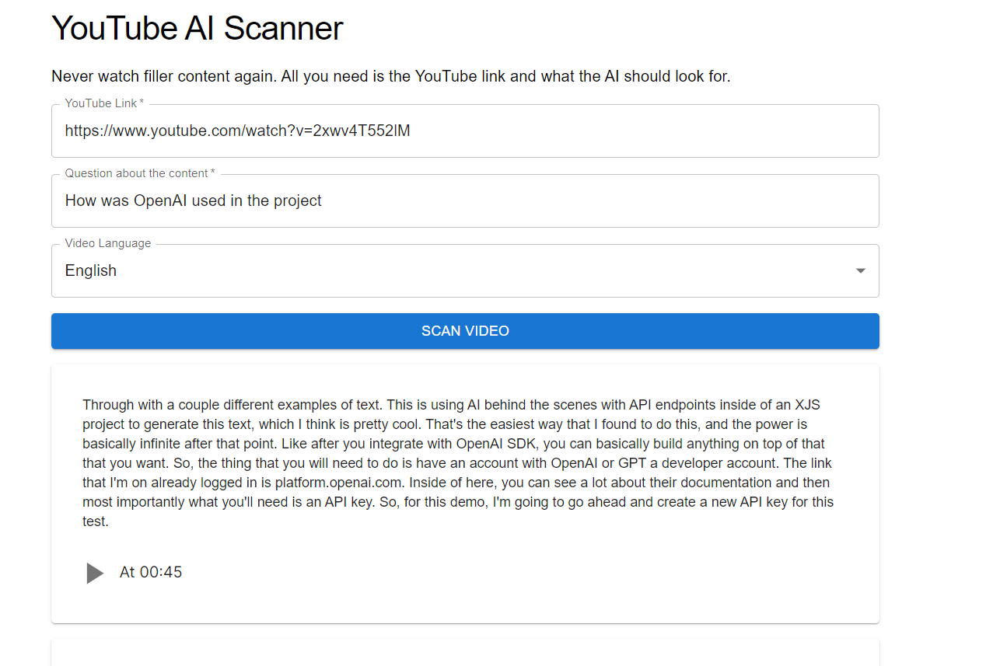

This is a [Next.js](https://nextjs.org/) project bootstrapped with [`create-next-app`](https://github.com/vercel/next.js/tree/canary/packages/create-next-app).

## Getting Started

Edit the .env.local file and add your api key to OPENAI_API_KEY, then run the development server:

```bash
npm run dev
```



Open [http://localhost:3000](http://localhost:3000) with your browser to see the result.


